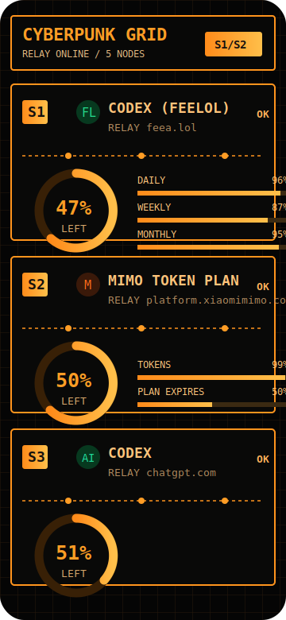
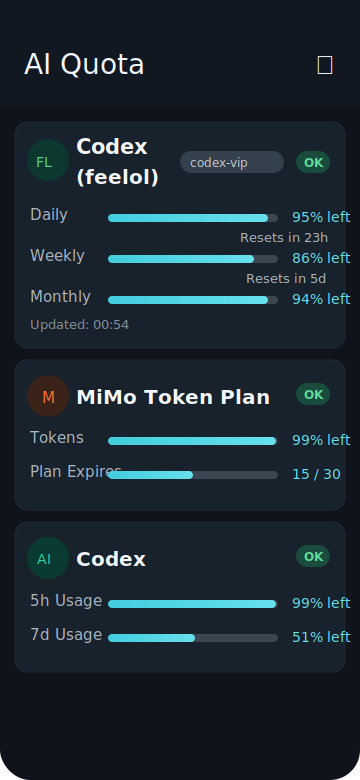
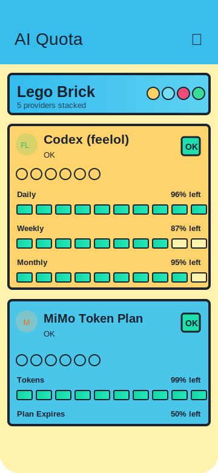
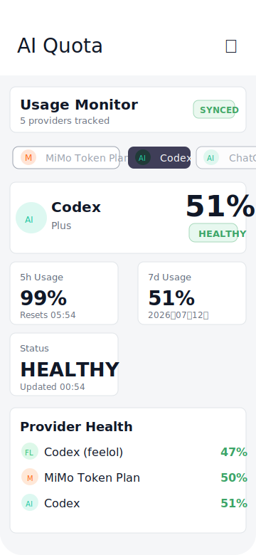

# AI Quota Dashboard

A mobile quota cockpit for tracking AI subscriptions, API balances, and usage windows across ChatGPT Plus, Codex, Codex (feelol), DeepSeek, MiMo, Claude, and Gemini.

Forked from [hyunnnchoi/CodexBar-android](https://github.com/hyunnnchoi/CodexBar-android), then rebuilt around Android, Jetpack Compose, encrypted local credentials, and multiple dashboard styles.

> Not an official OpenAI, Anthropic, DeepSeek, Google, Xiaomi, or feea.lol application. Credentials are provided by the user and stored locally on the device.

## Preview

<table>
  <tr>
    <td align="center" width="25%">
      <br/>
      <strong>Cyberpunk Grid</strong><br/>
      <sub>black-orange relay cockpit</sub>
    </td>
    <td align="center" width="25%">
      <br/>
      <strong>Mobile Native</strong><br/>
      <sub>compact Android cards</sub>
    </td>
    <td align="center" width="25%">
      <br/>
      <strong>Lego Brick</strong><br/>
      <sub>chunky block progress</sub>
    </td>
    <td align="center" width="25%">
      <br/>
      <strong>Monitor Panel</strong><br/>
      <sub>usage monitor / control panel</sub>
    </td>
  </tr>
</table>

## Highlights

- **Multi-provider quota dashboard** for ChatGPT Plus, Codex, Codex (feelol), DeepSeek, MiMo, Claude, and Gemini.
- **Quota windows** for short-cycle limits such as Codex 5h / 7d, feelol daily / weekly / monthly, MiMo tokens, and plan expiry.
- **Dashboard layout presets** designed as full UI skins, not just color swaps:
  - `MOBILE_NATIVE`: native Compose cards for everyday use.
  - `LEGO_BRICK`: toy-like modular cards and segmented brick progress bars.
  - `CYBERPUNK_GRID`: black-orange grid, relay nodes, S1/S2/S3 labels, circular gauge feel.
  - `MONITOR_PANEL`: usage monitor layout with provider tabs, metric tiles, and health summary.
- **Local credential storage** with Android EncryptedSharedPreferences.
- **No release logging of secrets**. API keys, tokens, cookies, and session responses should never be printed to logcat.

## Supported Providers

| Provider | What it shows | Auth / input |
|---|---|---|
| **ChatGPT Plus** | Plan metadata and renewal information from ChatGPT session JSON | ChatGPT session response |
| **Codex** | 5h and 7d usage windows | ChatGPT session access token or saved usage JSON |
| **Codex (feelol)** | Daily, weekly, monthly usage, plus plan expiry | feea.lol bearer token or subscriptions JSON |
| **DeepSeek** | API balance: total / granted / topped-up balance | DeepSeek API key |
| **MiMo Token Plan** | Token balance and plan expiry | Backend URL or direct cookie mode |
| **Claude** | Legacy quota integration | Access token |
| **Gemini** | Legacy OAuth quota integration | OAuth token |

## Provider Notes

### Codex

Codex usage is queried through ChatGPT-backed session credentials. The app should not ask users to open `backend-api/wham/usage` directly in a browser because that endpoint requires a bearer token. The expected flow is:

1. Open ChatGPT session JSON while signed in.
2. Extract `accessToken`.
3. Let the app call the Codex usage API with `Authorization: Bearer <accessToken>`.

### Codex (feelol)

The feea.lol integration uses:

```text
https://feea.lol/api/v1/subscriptions?timezone=Asia%2FShanghai
```

It maps:

- `daily_usage_usd / daily_limit_usd` → Daily quota window
- `weekly_usage_usd / weekly_limit_usd` → Weekly quota window
- `monthly_usage_usd / monthly_limit_usd` → Monthly quota window
- `starts_at / expires_at` → Expires progress bar

### DeepSeek

DeepSeek is API-key only. The previous browser-cookie path against `platform.deepseek.com` is intentionally deprecated because it depends on a private web endpoint and can reject Android WebView requests.

The stable path is:

```text
GET https://api.deepseek.com/user/balance
Authorization: Bearer <DeepSeek API Key>
```

The official balance response exposes current balance values. If you want estimated spend, configure an optional initial total so the app can derive:

```text
used = initialTotal - total_balance
```

## Build

### Debug APK

```bash
./gradlew clean assembleDebug --no-daemon
```

Output:

```text
app/build/outputs/apk/debug/app-debug.apk
```

### Install locally

```bash
adb uninstall com.codexbar.android
adb install app/build/outputs/apk/debug/app-debug.apk
```

For clean testing after auth-flow changes:

```bash
adb shell pm clear com.codexbar.android
```

## Configuration

1. Open **Settings** from the top-right gear.
2. Enable the providers you want to track.
3. Configure credentials per provider.
4. Choose a dashboard layout preset.
5. Validate each provider before relying on the dashboard.

Recommended first-run order:

```text
Codex (feelol) → Codex → ChatGPT Plus → MiMo → DeepSeek
```

## Security Model

- Credentials are stored locally with `EncryptedSharedPreferences`.
- The app does not need a custom backend for the default local mode.
- MiMo backend mode is supported for safer server-side cookie handling.
- Direct cookie modes are treated as advanced and should be avoided unless necessary.
- User can delete all credentials from Settings.

## Architecture

```text
core/
├── domain/model/        # QuotaInfo, UsageWindow, Credential, provider models
├── domain/repository/   # QuotaRepository + QuotaProvider interfaces
├── data/                # Repository implementations per provider
├── network/             # Retrofit API services + DTOs per provider
└── security/            # EncryptedSharedPreferences
feature/
├── dashboard/           # Dashboard screens, service cards, layout presets
└── settings/            # Provider configuration and validation
di/                      # Hilt modules
```

## Development Checklist

Before sharing a build:

```text
[ ] ./gradlew clean assembleDebug passes
[ ] DeepSeek Settings only shows API Key / Base URL / Initial Total
[ ] Codex(feelol) shows Daily / Weekly / Monthly / Expires
[ ] ChatGPT Plus session JSON validates without renewal-date-only fallback errors
[ ] No token, cookie, API key, or session JSON appears in logs
[ ] Dashboard presets can be switched without crashing
```

## License

MIT
